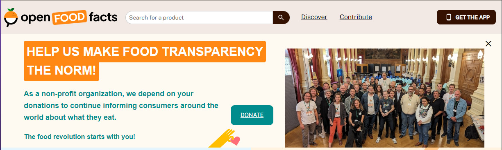

<a>
   
</a>

<br><br>

<div align=center> 
<h1>About the Project</h1>

The project extracts information about food products from [Open Food Facts](https://world.openfoodfacts.org), including the product name, description, quantity, brand, manufacturing location, and nutritional information, such as the Nutri-Score and its composition. This information is transformed into an API, which is documented using Swagger. The documentation allows for the use of custom filters to interact with the API more efficiently.

<br><br>
<h2>👩‍💻 Technologies:</h2> 
<p>
  <div  align="center"><br>
  
  
   
</div>
</p>


<br><br>
<h2>🚀 Getting started:</h2> 

<h3>🚨 Prerequisites</h3>
Having Node.js learn more at <a href="https://nodejs.org">nodejs.org</a>
<br>
Have Git installed learn more at<a href="https://git-scm.com">git-scm.com</a>

<h3>🔧 Installation</h3>

1. Clone the repository
```sh
   git clone https://github.com/agdaLopes/puppeteerswaggerapi.git
```

2. Install Express:
```sh
   npm install express
```

3. Install Puppeter:
```sh
   npm install puppeter
```

4. Install Swagger UI Express:
```sh
   npm install swagger-ui-express
```

5. Install YAMLjs:
```sh
   npm install yamljs
```

6. Install body-parser (to process POST requests):
```sh
   npm install body-parser
```

7. Install Swagger-jsdoc:
```sh
   npm install swagger-jsdoc
```

<h3>✅how to run the project?</h3>

```sh
   node puppeteerswagger.js
```


<h3>⚙️API</h3>

1. Access the Swagger UI
```sh
   http://localhost:8080/api-docs/
```

2. Access the product list
```sh
   localhost:8080/products
```

3. Filter products
```sh
   localhost:8080/products?nutrition=A&nova=1
```

4. Access the product through ID
```sh
   localhost:8080/products/3155250349793
```
</div>